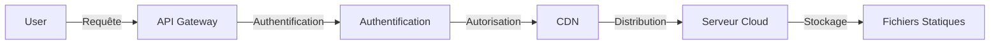

# Cloud Computing : Plateforme de Diffusion de Contenu Statique

## Introduction

Ce projet vise à créer une plateforme de diffusion de contenu statique utilisant des services cloud pour héberger et distribuer des fichiers statiques tels que des images, des vidéos, des documents PDF, etc. L'objectif est de fournir une solution scalable, sécurisée et facile à gérer pour la diffusion de contenu à grande échelle.

## Objectifs du Projet

- **Scalabilité** : Assurer que la plateforme peut gérer un nombre croissant d'utilisateurs et de contenus sans dégradation des performances.
- **Sécurité** : Protéger les contenus contre les accès non autorisés et les cyberattaques.
- **Facilité de Gestion** : Simplifier l'ajout, la mise à jour et la suppression de contenus par les administrateurs.
- **Performance** : Optimiser la vitesse de chargement des contenus pour une expérience utilisateur optimale.

## Architecture

### Composants Principaux

- **Serveur Cloud** : Utilisation d'un service cloud comme AWS S3 pour le stockage des fichiers statiques.
- **CDN (Content Delivery Network)** : Pour la distribution rapide des contenus à travers le monde.
- **API Gateway** : Pour gérer les requêtes et les réponses entre les utilisateurs et le serveur.
- **Authentification et Autorisation** : Utilisation de services comme AWS Cognito pour la gestion des utilisateurs et des permissions.

### Schéma de l'Architecture

## Technologies Utilisées

- **AWS S3** pour le stockage des fichiers.
- **CloudFront** pour le CDN.
- **API Gateway** pour la gestion des API.
- **AWS Lambda** pour des fonctions serverless si nécessaire.
- **AWS Cognito** pour la gestion des utilisateurs.

## Installation et Configuration

### Pré-requis

- Compte AWS actif.
- Connaissance de base des services AWS.

### Étapes d'Installation

1. **Créer un Bucket S3** : Configurez un bucket S3 pour stocker vos fichiers statiques.
2. **Configurer CloudFront** : Associez votre bucket S3 à CloudFront pour la distribution de contenu.
3. **API Gateway** : Configurez une API Gateway pour gérer les requêtes.
4. **Authentification** : Configurez AWS Cognito pour gérer les utilisateurs et les permissions.

## Utilisation

### Ajout de Contenu

- Utilisez l'interface AWS S3 pour télécharger vos fichiers statiques.
- Configurez les permissions pour que les fichiers soient accessibles via le CDN.

### Accès au Contenu

- Les utilisateurs peuvent accéder au contenu via l'URL fournie par CloudFront.

## Sécurité

- **Chiffrement** : Utilisation de SSL/TLS pour sécuriser les transferts de données.
- **Permissions** : Gestion fine des permissions via AWS IAM et Cognito.

## Maintenance et Mise à Jour

- **Mise à Jour des Contenus** : Les administrateurs peuvent mettre à jour les fichiers directement dans le bucket S3.
- **Surveillance** : Utilisation de CloudWatch pour surveiller les performances et les erreurs.

## Contribution

- Ce projet est ouvert aux contributions. Veuillez consulter le fichier CONTRIBUTING.md pour plus de détails.

## Licence

- Ce projet est sous licence MIT. Voir le fichier LICENSE pour plus de détails.

---

Ce README fournit une vue d'ensemble du projet, de son architecture, des technologies utilisées, et des instructions pour l'installation et l'utilisation. Il est conçu pour être informatif et utile pour les développeurs et les administrateurs qui pourraient travailler sur ou avec ce projet.
